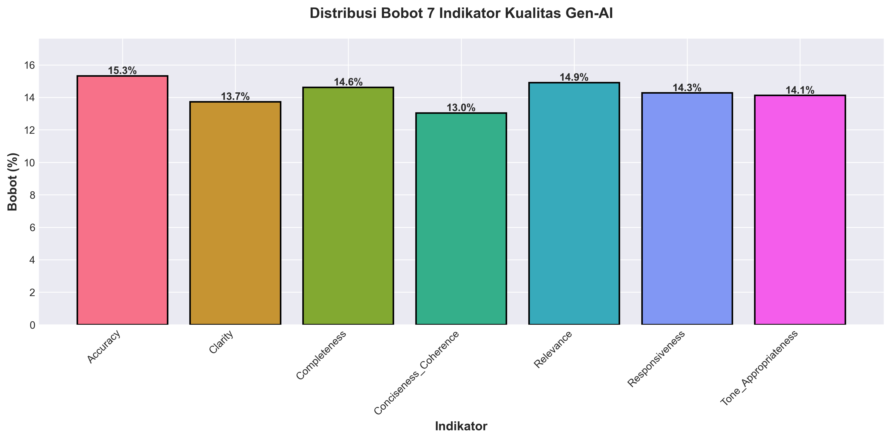
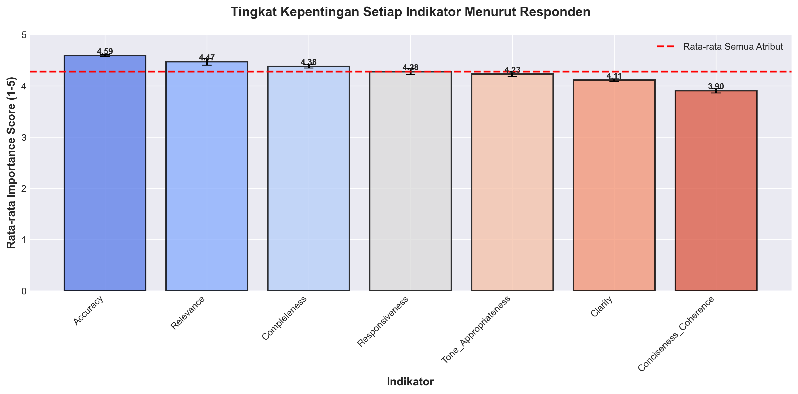
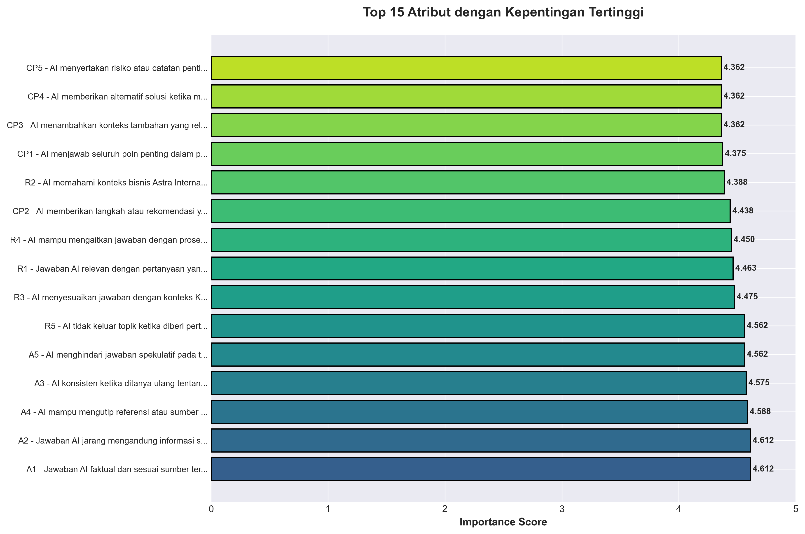
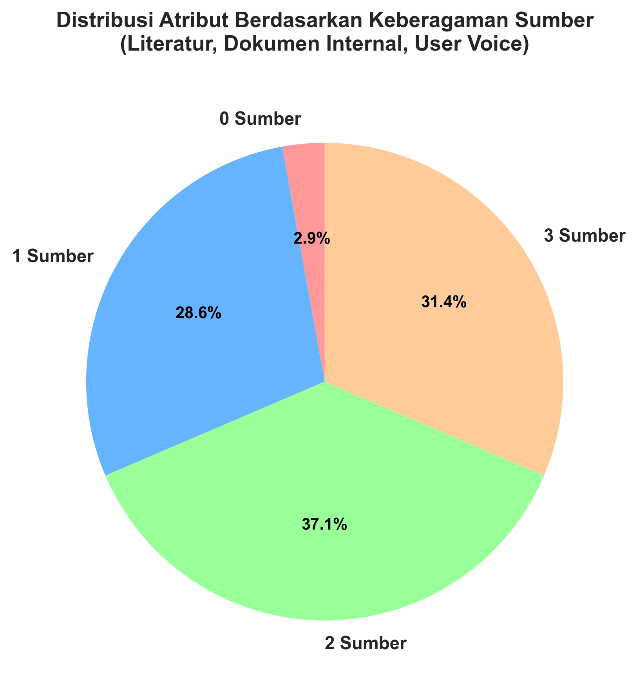
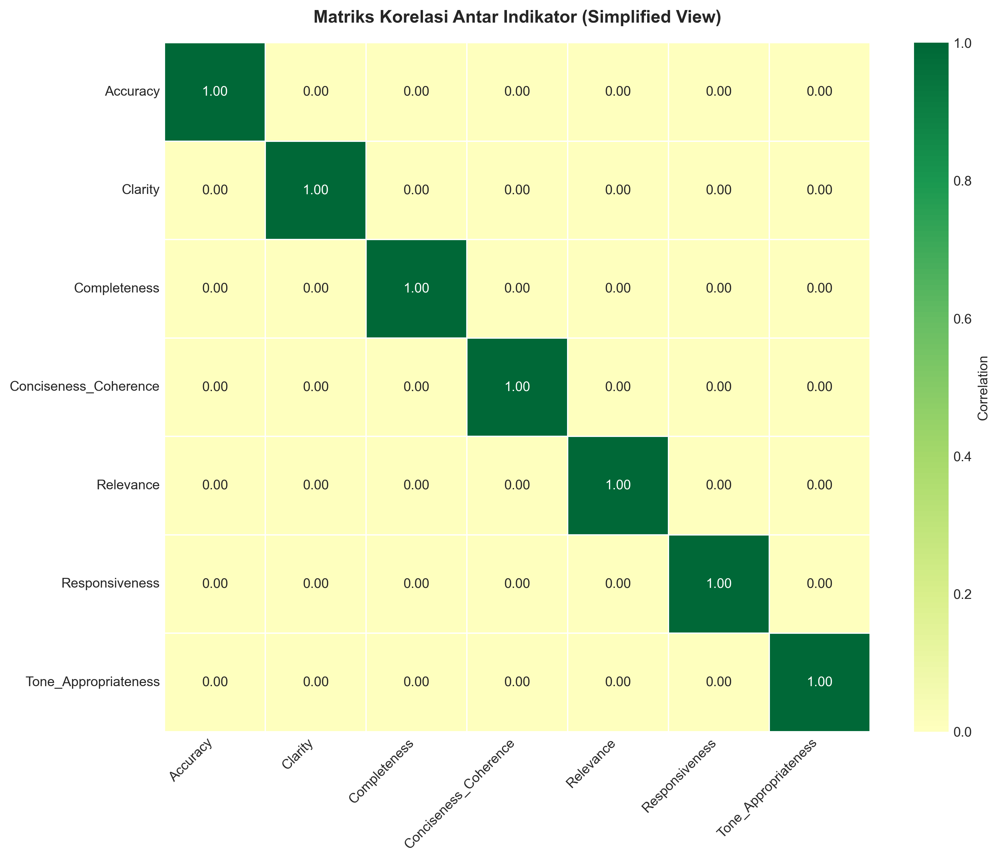
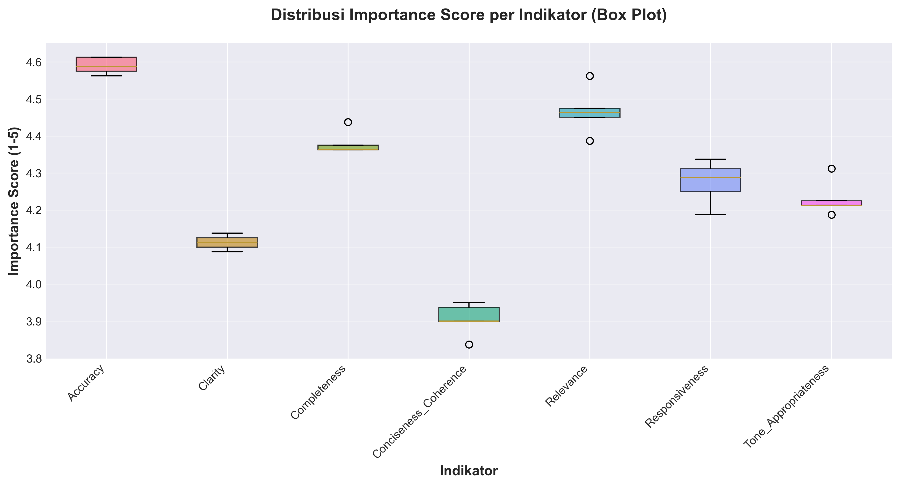
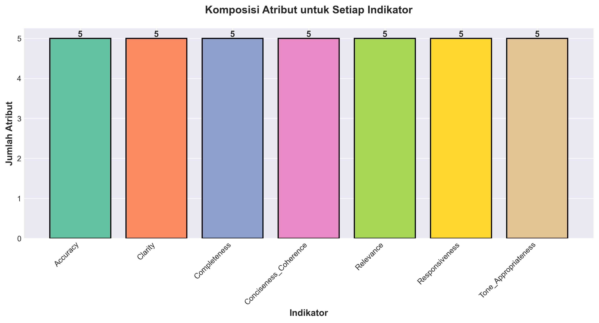

 # Mining DSS – Astra Gen-AI KM

Proyek ini menganalisis atribut kualitas Gen-AI di KM Astra dan menghasilkan bobot indikator berbasis data. Hasilnya jadi fondasi untuk membangun Decision Support System (DSS) penilaian Gen-AI yang objektif.

## 📋 Untuk Apa Proyek Ini?

Kita punya 35 atribut kualitas Gen-AI dari berbagai sumber (literatur, internal doc, user voice). Dari sini, kita ekstrak 7 indikator utama dan hitung bobotnya berdasarkan tingkat kepentingan menurut responden (HC, line manager, staff, KM specialist, IT data).

Hasilnya:
- **7 Indikator** dengan bobot masing-masing
- **Dokumentasi lengkap** dari mana asal setiap indikator
- **Data untuk DSS** siap pakai di Excel atau sistem lain

## 🎯 Tujuan

Bukannya ngira-ngira atau pakai intuisi, DSS penilaian Gen-AI kita ingin didukung data nyata. Proyek ini buat justifikasi yang jelas:

> "Indikator Accuracy punya bobot 15%, bukan karena katanya, tapi karena responden menganggapnya penting (rata-rata skor 4.6 dari 5), dan ini didukung oleh 5 atribut spesifik yang saling berkorelasi tinggi."

## 🏗️ Struktur Proyek

```
mining-dss/
├── data/
│   ├── raw/
│   │   ├── attributes_master.csv      # Daftar 35 atribut lengkap
│   │   └── survey_responses.csv       # Skor kepentingan dari responden
│   └── processed/
│       ├── attributes_with_importance.csv    # Atribut + skor importance
│       ├── attribute_correlation_matrix.csv  # Matriks korelasi antar atribut
│       └── indicator_weights.csv             # Bobot 7 indikator (output utama)
├── src/
│   ├── data_prep.py           # Load dan enrich raw data
│   ├── analysis.py            # Hitung importance tiap atribut
│   ├── clustering.py          # Korelasi antar atribut
│   ├── scoring.py             # Bobot indikator
│   └── config.py              # Konfigurasi global
├── notebooks/
│   └── 01_exploration_placeholder.txt
├── visualize_results.py        # Buat grafik hasil analisis
├── run_pipeline.py            # Jalankan semua tahap
├── requirements.txt           # Dependencies
└── README.md                  # File ini
```

## 📊 Tahapan Analisis

### 1️⃣ Data Preparation
# Mining DSS – Astra Gen-AI KM

Proyek ini menganalisis atribut kualitas Gen-AI di KM Astra dan menghasilkan bobot indikator berbasis data. Hasilnya jadi dasar untuk Decision Support System (DSS) penilaian Gen-AI yang praktis dan transparan.

## Ringkasan singkat

- Input: `attributes_master.csv` (35 atribut) dan `survey_responses.csv` (skor penting dari responden)
- Output utama: `data/processed/indicator_weights.csv` (bobot 7 indikator)
- Visualisasi siap pakai ada di folder `visualizations/`

## Struktur singkat proyek

```
mining-dss/
├── data/raw/
├── data/processed/
├── src/ (data_prep, analysis, clustering, scoring)
├── visualize_results.py
├── run_pipeline.py
└── visualizations/ (grafik yang di-generate)
```

## Cara cepat (jalankan visualisasi)

Pastikan dependencies terpasang lalu jalankan:

```powershell
python -m venv .venv
.venv\Scripts\activate
pip install -r requirements.txt
python visualize_results.py
```

Grafik akan tersimpan di `visualizations/`.

## Visualisasi (preview)

Berikut beberapa visual utama yang dihasilkan — gambar tersimpan di `visualizations/`.

01. Bobot 7 indikator (bar chart)



02. Importance per indikator (rata-rata + std)



03. Top 15 atribut (importance tertinggi)



04. Source diversity (literatur / internal / user)



05. Correlation heatmap (simplified view)



06. Distribusi importance (box plots)



07. Jumlah atribut per indikator



> Catatan: Gambar akan terlihat di GitHub setelah commit & push ke repo.

## Hasil utama (singkat)

File `data/processed/indicator_weights.csv` berisi bobot indikator yang bisa langsung dipakai di Excel DSS.

Contoh ringkasan bobot:

| Indikator | Score | Bobot (%) |
|---|---:|---:|
| Accuracy | 4.59 | 15.3 |
| Relevance | 4.47 | 14.9 |
| Completeness | 4.38 | 14.6 |
| Responsiveness | 4.28 | 14.3 |
| Tone/Appropriateness | 4.23 | 14.1 |
| Clarity | 4.11 | 13.7 |
| Conciseness/Coherence | 3.91 | 13.0 |

Bobot ini dihitung dari rata-rata importance atribut per indikator, lalu dinormalisasi.

## File output penting

- `data/processed/attributes_with_importance.csv` — detail 35 atribut + mean/std
- `data/processed/attribute_correlation_matrix.csv` — matriks korelasi antar atribut
- `data/processed/indicator_weights.csv` — bobot 7 indikator (output utama)
- `visualizations/` — gambar hasil analisis

## Penjelasan singkat: bagaimana pakai di DSS Excel

1. Buat tabel rating: 7 indikator × N model
2. Masukkan bobot dari `indicator_weights.csv`
3. Hitung total score: SUMPRODUCT(rating_vector, weight_vector)
4. Ranking model berdasarkan total score

## Dokumentasi & files lainnya

- `ANALYSIS_SUMMARY.md` — interpretasi hasil dan panduan membaca grafik
- `QUICKSTART.md` — panduan cepat setup dan troubleshooting
- `DELIVERABLES.md` — ringkasan deliverables dan status

---

Jika mau saya rapihkan lagi (mis. ubah tata letak gambar, ubah caption, atau masukkan versi gambar kecil/thumbnail), beri tahu layout yang diinginkan.

**Dibuat**: November 2025
**Versi**: 1.1
